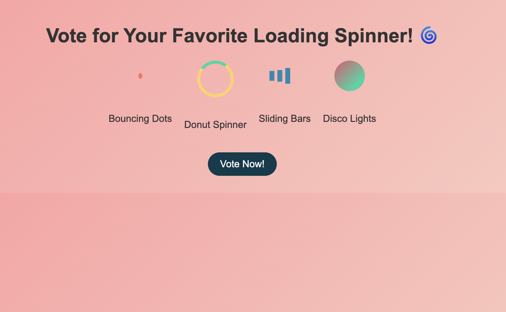

# Day 7: Funny Loading Spinner Collection 🎨  

## Project Description  
This project features a collection of creative and funny loading spinners designed to make waiting more enjoyable. The collection includes:  
- **Bouncing Dots**  
- **Donut Spinner**  
- **Sliding Bars**  
- **Disco Lights**  

Each spinner has unique animations, and users are encouraged to vote for their favorite.  

---

## Features  
1. **Bouncing Dots**: A playful animation of dots bouncing in sequence.  
2. **Donut Spinner**: A rotating circular spinner with a gradient.  
3. **Sliding Bars**: Bars that slide and pulse rhythmically.  
4. **Disco Lights**: A glowing spinner with colorful, vibrant effects.  
5. **Vote Button**: Users can cast their votes through an interactive button.  

---

# Demo page
Click [Here](https://ayshasanyang.github.io/Day-7-loading-spinner-collection/) to view the page
---

## 🚀 How to Run
1. Download or clone the repository
```bash
git clone https://github.com/ayshasanyang/Day-7-loading-spinner-collection.git
```
2. Navigate to the project folder.
3. Open the project files in your vscode or any code editor of your choice
4. Open the `index.html` file in your web browser.

---

## 🛠️ Technologies Used
- **HTML** for structure
- **CSS** for styling and animations
- **JavaScript** for interactivity

### 📸 Preview


---

## 📢 Connect
If you enjoyed this project, let me know! Follow me on social media to see more coding content:
- Instagram: [@codewithaysha](#)
- TikTok: [@Aysha](#)

---